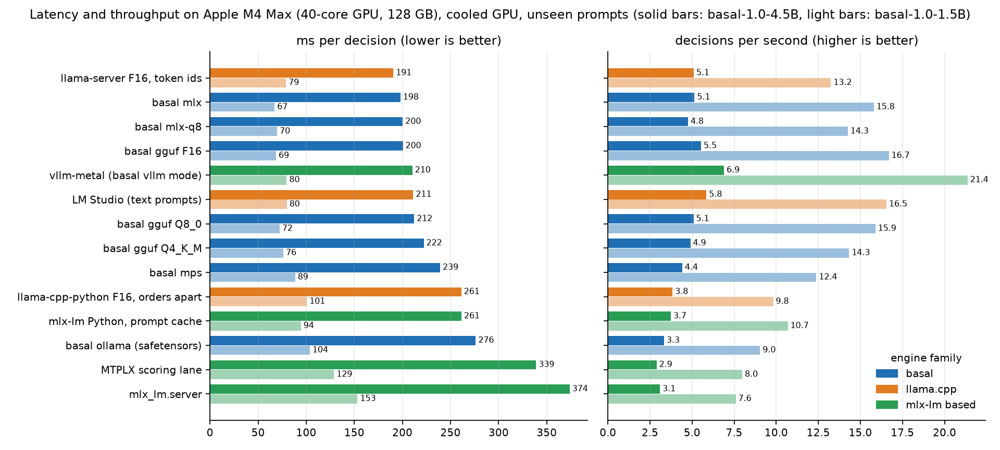
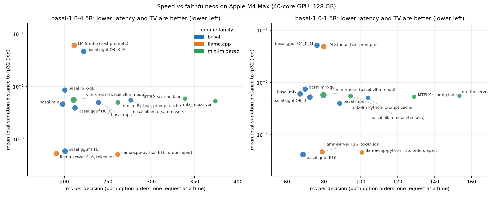
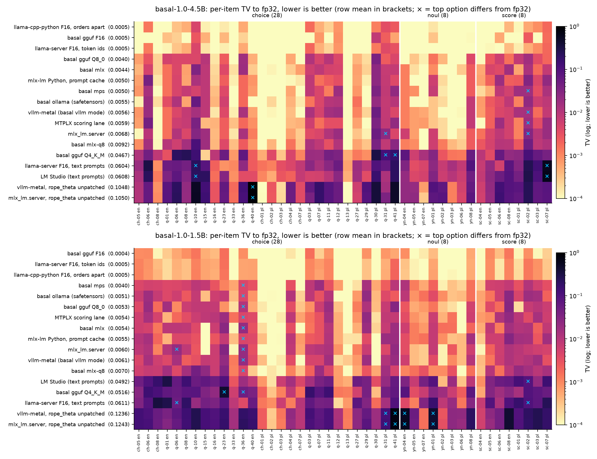
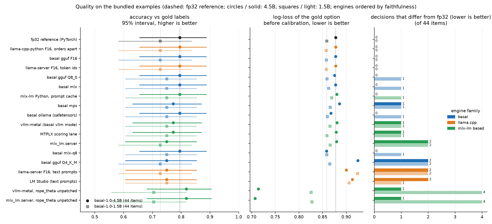
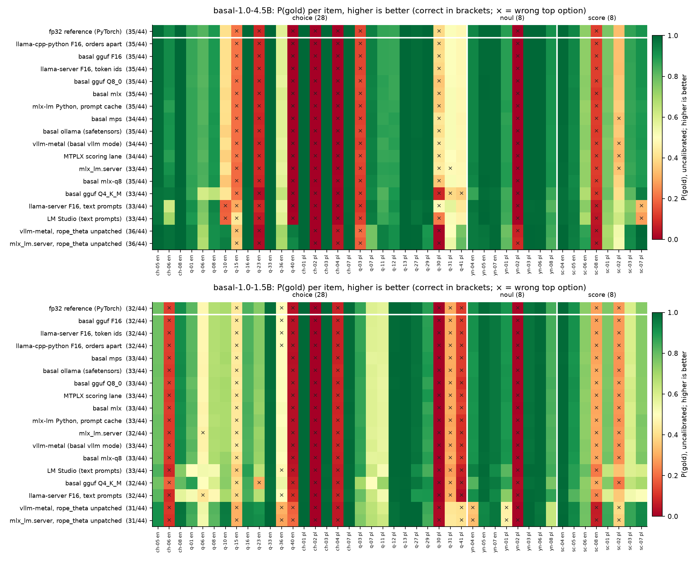
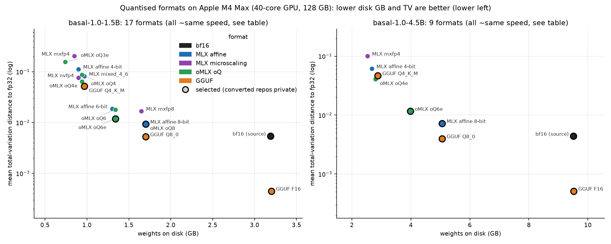
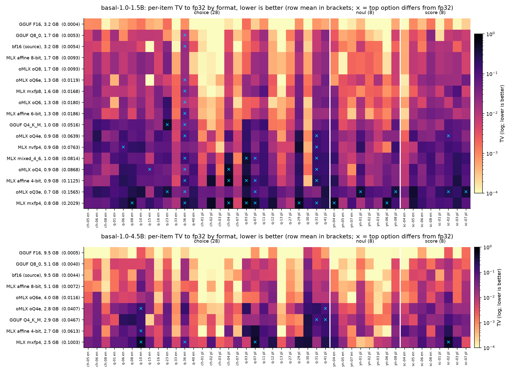

# Hardware: which mode on which GPU

**What these numbers are.** The tables below were measured with the **basal-1.0 weights and engine** (offline,
`basal-bench`). basal-1.5 (4.5B) has the architecture of basal-1.0-4.5B and basal-1.5-mini that of basal-1.0-1.5B
(each pair is fine-tuned from the same Bielik base model), so the tables show what each GPU does with these model
sizes and which mode to choose; they are not measurements of the 1.5 models. The *accuracy* and *agreement* columns are
those of the basal-1.0 weights on our speed sample; for the accuracy of the 1.5 models see the
[README](../README.md#performance). basal-1.5-max (11B) and Apple Silicon have their own sections below.

**basal-1.5 release check** (one H100, `basal-serve --mode fast`, bf16, HTTP load test): one question 13.7 ms p50 /
23.8 ms p95, 64.4 decisions/s with 32 concurrent clients (basal-1.0 was not re-measured on that machine).
**basal-1.5-mini, release check** (same setup): one question 10.9 ms p50 / 15.9 ms p95, 155.8 decisions/s with 32 concurrent clients (basal-1.0-1.5B was not re-measured on that machine). Do not compare these HTTP numbers with the offline tables below.

One decision = **both option orders** (the default), batch size 1 unless stated. *dec/s*: two-order decisions per
second with 32 option-order passes per forward (offline) or 32 concurrent clients (HTTP). *Agreement*: share of
decisions whose top option equals the fp32 reference on the same machine (RTX 5090 and RTX 4090: the bf16 reference,
marked ²). Measured with `basal-bench` / `basal-loadtest` (H100, RTX PRO 6000 and RTX 5090 with the equivalent research
harness) on a private 500-item sample of the Polish/English test split. Requests with several questions are much
cheaper than separate requests since basal-1.5: see [SOAM.md](SOAM.md).

## Engines

Which engine runs where, and what is verified on basal-1.5 (the per-GPU tables further down are basal-1.0 engine-only
measurements):

<!-- engines -->
| engine | `basal-serve` mode | hardware | what it is for | quick start | status (basal-1.5, 4.5B) |
|---|---|---|---|---|---|
| **basal engine** (PyTorch) | `fast` (also `fast-nocompile`, `fp8`, `nvfp4`); `mps`; `eager --device mps\|cpu` | NVIDIA GPUs (sm80+); Apple Silicon with `mps` (packed requests on the Mac's GPU, no CUDA graphs) or `eager`; CPU with `eager` | the primary server: packed requests (SOAM), evidence spans, `fp8` on Hopper and Blackwell | `basal-serve --model Remek/basal-1.5-4.5B --mode fast` | **verified**: served check on one H100, 13.7 ms p50 per question over HTTP, 64.4 decisions/s with 32 clients |
| **vLLM** | `vllm` | NVIDIA GPUs | an alternative CUDA server | `basal-serve --model Remek/basal-1.5-4.5B --mode vllm` (extra `basal[vllm]`) | **verified offline** (one H100, `basal-bench`, 1,000 development decisions): agreement 0.994 with the fp32 engine, accuracy 0.928 vs 0.930, 147 decisions/s |
| **SGLang** | `sglang` | NVIDIA GPUs | an alternative CUDA server (RadixAttention prefix sharing) | `basal-serve --model Remek/basal-1.5-4.5B --mode sglang` (own environment: `sglang[srt]==0.5.21`, then basal with `--no-deps`) | **verified offline** (one H100, `basal-bench`, 1,000 development decisions): agreement 0.995 with the fp32 engine, accuracy 0.925 vs 0.930, 104.6 decisions/s; on Werdykt the same answer as the basal engine on 98.3% of items (97.0% for states over 8k tokens) |
| **MLX** | `mlx` (default on a Mac with `basal[mlx]`); `mlx-q8` | Apple Silicon | Macs: `-MLX-8bit` (recommended) or `-MLX-fp4` (half the memory); `mlx-q8` makes 8-bit weights from bf16 at load time | `basal-serve --model Remek/basal-1.5-4.5B-MLX-8bit --mode mlx` (extra `basal[mlx]`) | **verified** on an Apple M4 Pro (500 development decisions): agreement with bf16 0.992 (`-MLX-8bit`) / 0.970 (`-MLX-fp4`), 587 / 581 ms per question |
| **Ollama** | `ollama` | CPU, Apple Silicon, consumer GPUs | local and desktop use with Ollama (`-GGUF`) | 1. `hf download Remek/basal-1.5-4.5B-GGUF --local-dir basal-1.5-4.5B-GGUF` 2. in that folder: `ollama create basal-1.5-4.5b:q8_0 -f Modelfile.Q8_0` 3. `basal-serve --model ./basal-1.5-4.5B-GGUF --mode ollama --ollama-model basal-1.5-4.5b:q8_0` | **verified** on an Apple M4 Pro (500 development decisions): agreement with bf16 0.994 (`Q8_0`) / 0.980 (`Q4_K_M`), 518 / 542 ms per question |
| **llama.cpp** | `llamacpp`; `gguf` | CPU, Apple Silicon, consumer GPUs | `llama-server` with the `-GGUF` files; the engine's token ids are sent as is. `--mode gguf --gguf <file>` runs the file in process instead (extra `basal[gguf]`, [GGUF.md](GGUF.md)) | 1. `llama-server -m basal-1.5-4.5B-GGUF/basal-1.5-4.5B-Q8_0.gguf -c 4096 --port 8080` 2. `basal-serve --model ./basal-1.5-4.5B-GGUF --mode llamacpp` | **verified** on an Apple M4 Pro (500 development decisions): agreement with bf16 0.994 (`Q8_0`) / 0.980 (`Q4_K_M`), 427 / 446 ms per question |

**`basal-serve` is the decision layer in every row.** vLLM, SGLang, MLX, Ollama and llama.cpp run the weights; the typed answers (a calibrated probability for each of your options, both option orders, the state shared by several questions, `multi`, `act` and `facts`) come from `basal-serve --mode <engine>` in front of them, with the same HTTP API in every mode. A plain `ollama run` or `llama-cli` gives free text only. Evidence spans need the PyTorch engine (`fast`, `eager`); vLLM and SGLang start with a 4,096-token context (longer states are refused); raise it with `--max-len` (e.g. 32768 for long documents). Install and first request for each engine: [quick start](../README.md#quick-start).
<!-- /engines -->

## Recommendation

| GPU class | recommended mode | why |
|---|---|---|
| Data-centre (B300, B200, H100, H200) | `fast` (bf16) | limited by kernel launches at batch 1: FP8 gains ≤ 10% on H100 and is slower on B300, bf16 keeps decisions unchanged |
| Workstation / consumer (RTX PRO 6000, RTX 5090) | `fp8` | compute-bound; FP8 gives 1.3–1.4× at 97% agreement |
| RTX 4090 | `fast` (bf16) | FP8 compilation stalled on our test machine; bf16 works (1.5B: 12.5 ms) |
| Desktop with unified memory (DGX Spark GB10) | `fp8` | memory-bandwidth-bound; FP8 halves latency |
| Batched high-throughput serving with vLLM | `vllm` + the `-FP8` checkpoint on Hopper / Ada, the `-NVFP4` checkpoint on Blackwell (RTX 50xx, RTX PRO 6000, B200, DGX Spark); see [QUANTIZATION](QUANTIZATION.md#basal-15-the-modelopt-checkpoints) | basal-1.0 NVFP4: 3.2× throughput on the DGX Spark, but −3 accuracy points; the basal-1.5 checkpoints' agreement and speed: FP8 agrees with the bf16 model on 0.979–0.989 of decisions; NVFP4 on 0.979 for max and 0.937 for basal-1.5 (−2.8 points); no NVFP4 for mini |
| A100 and other GPUs without FP8 (not measured) | `fast` | the bf16 path runs on any sm80+ GPU |
| Apple Silicon (M-series) | MLX port: `-MLX-8bit` (decisions as with bf16); `-MLX-fp4` for 8 GB Macs (about 1.4 accuracy points less on basal-1.5, 2.0 on max, 3.6 on mini: for mini prefer `-MLX-8bit` or GGUF); without MLX: `gguf` (a `-GGUF` file in process) or `mps` (PyTorch, evidence spans) | see [Apple Silicon](#apple-silicon) |
| Google TPU (v5e measured) | `tpu` (bf16) | XLA-compiled JAX with the shared prefix; the 4.5B fits one 16 GB v5e chip and agrees 1.000 with fp32 |

With basal-1.0 models (which ship exit heads), add `--mode fast-exit` to let requests choose `"early_exit": "0.99"`
(about 1.15× faster, agreement ≥ 0.99). The basal-1.5 models do not ship exit heads; serve them with `fast`.

## Measured (4.5B architecture: basal-1.5, basal-1.0-4.5B)

| GPU | mode | 2 orders (ms) | dec/s | agreement | accuracy |
|---|---|---|---|---|---|
| **B300 SXM6** | `fast` (bf16) | **8.8** | 109 | 1.000 | 0.822 |
| | `fp8` | 9.7 | 102 | 0.974 | 0.824 |
| | `nvfp4` (torchao) | 13.9 | 63 | 0.904 | 0.790 |
| | `fast-exit`, 0.99 | **7.7** | **119** | 0.998 | 0.824 |
| | HTTP `fast` (p50) | **9.7** | 109 | – | – |
| | HTTP `fp8` (p50) | 10.4 | **119** | – | – |
| **H100 80GB** | `fast` (bf16) | 12.5 | 63 | 0.993 | 0.826 |
| | `fp8` | 11.3 | 80 | 0.976 | 0.830 |
| | `fast-exit`, 0.99 | 10.5 | 65 | 0.992 | 0.820 |
| | HTTP `fast` (p50) | 14.1 | 63 | – | – |
| | HTTP `fast-exit`, 0.99 (p50) | 12.1 | 77 | – | – |
| **RTX PRO 6000 Blackwell** | `fast` (bf16) | 18.9 | 39 | 0.994 | 0.822 |
| | `fp8` | 14.9 | 58 | 0.968 | 0.840 |
| | HTTP `fast` (p50) | 22.5 | 39 | – | – |
| **RTX 5090** | `fast` (bf16) | 27.3 (28.0 on a second machine) | 24 | 0.999² | 0.824 |
| | `fp8` | 19.4 | 40 | 0.968² | 0.828 |
| | HTTP `fast` (p50) | 32.3 | 23 | – | – |
| **DGX Spark (GB10)** | `eager` fp32 | 800.4 | 0.4 | reference | 0.822 |
| | `fast` (bf16) | 92.0 | 7.0 | 0.996 | 0.826 |
| | `fp8` | **44.6** | 8.3 | 0.970 | 0.836 |
| | `nvfp4` (torchao) | 41.0 | 10.4 | 0.910 | 0.792 |
| | `vllm` + NVFP4 checkpoint | 46.1 | **26.6** | 0.896¹ | 0.792 |
| | `fast-exit`, 0.99 | 76.9 | 7.6 | 0.994 | 0.828 |

¹ agreement with bf16 (which agrees with fp32 on 99.6%). ² agreement with bf16 eager (no fp32 run on this card).

## 1.5B architecture: basal-1.5-mini, basal-1.0-1.5B

| GPU | `fast` (bf16) | dec/s | `fp8` | dec/s | agreement bf16 / fp8 | vs 4.5B bf16 |
|---|---|---|---|---|---|---|
| B300 SXM6 | **4.7 ms** | **250** | 5.2 ms | 224 | 0.994 / 0.966 | 1.9× faster |
| H100 80GB | 6.2 ms | 157 | 6.3 ms | 177 | 0.992 / 0.964 | 2.0× |
| RTX PRO 6000 Blackwell | 8.8 ms | 101 | 7.6 ms | 128 | 0.998 / 0.968 | 2.2× |
| RTX 5090 | 12.7 ms | 67 | 9.3 ms | 99 | 0.996 / 0.960 | 2.2× |
| RTX 4090 | 12.5 ms | 51 | – | – | reference | – |
| DGX Spark (GB10) | 34.3 ms | 20 | **18.1 ms** | 31 | 0.996 / 0.962 | 2.7× |

Speed-up against the 4.5B model measured with the released engine on the same machine (RTX PRO 6000: 19.1 ms,
RTX 5090: 28.0 ms; the earlier runs above: 18.9 and 27.3 ms). Agreement with fp32 (RTX 4090: bf16 is the reference).

HTTP on H100 (`basal-serve --mode fast`): 7.7 ms p50, 147 decisions/s with 32 clients. NVFP4 on the DGX Spark: 16.5 ms
but agreement 0.87 — not recommended. RTX 4090: the FP8 compilation stalled on our test machine; bf16 works.

## 11B: basal-1.5-max

Measured on one H100; other GPUs were not measured for max.

| engine | measurement | result |
|---|---|---|
| basal engine, `fast` (bf16) | HTTP load test, one question per request, 32 concurrent clients | 27.3 ms p50 / 46.6 ms p95 for one question, 33.4 decisions/s; bf16 with SOAM agrees with the fp32 reference on 0.993 of 1,500 decisions |
| vLLM | – | not measured for max (verified on basal-1.5: agreement 0.994 with the fp32 engine) |
| SGLang (sglang 0.5.21) | Werdykt, 5,000 decisions, against the basal engine's `fast` mode | the same answer on 99.4% of decisions (98.4% for states over 8k tokens); not measured offline for max |

In-process engine, one H100, p50 per request: 30.7 ms for one question; 68 ms for 5 questions and 148 ms for 12 with
SOAM, against 201 and 422 ms as separate prompts. SOAM answers equal separate prompts in fp32 (1.000, largest probability
difference 1.5e-5). The HTTP and engine numbers are not comparable with each other. The 11B model needs about 22 GB
for the bf16 weights alone, plus activations and CUDA graphs: on 24 GB cards use the 4.5B model (`--mode fp8` may fit,
but it was not measured for max). On Apple Silicon, see the ports below.

## Apple Silicon

Three routes: the **MLX** ports (`-MLX-8bit`, `-MLX-fp4`) with `--mode mlx` (the default on a Mac with
`basal[mlx]`); the **GGUF** ports (Ollama, `llama-server`, or `--mode gguf` in process); and **PyTorch** on the GPU of
the Mac: `--mode mps` (bf16, the packed requests of `fast` without CUDA graphs) or the plain reference
`--mode eager --device mps`. The
reference is the bf16 model in PyTorch; for basal-1.5-max, which does not fit a 24 GB Mac in bf16, it is the GGUF
`Q8_0` port with llama.cpp (on basal-1.5 (4.5B), `Q8_0` agrees with bf16 on 0.994).

| machine | model | route | latency per decision | agreement with the reference | memory |
|---|---|---|---|---|---|
| Apple M4 Pro, 24 GB | basal-1.5 (4.5B) | PyTorch MPS, bf16 | 817 ms | reference | 9.5 GB |
| Apple M4 Pro, 24 GB | basal-1.5 (4.5B) | MLX `-MLX-8bit` | 587 ms | 0.992 | 5.2 GB |
| Apple M4 Pro, 24 GB | basal-1.5 (4.5B) | MLX `-MLX-fp4` | 581 ms | 0.970 | 2.9 GB |
| Apple M4 Pro, 24 GB | basal-1.5 (4.5B) | llama.cpp GGUF Q8_0 | 427 ms | 0.994 | 5.1 GB |
| Apple M4 Pro, 24 GB | basal-1.5 (4.5B) | Ollama GGUF Q8_0 | 518 ms | as llama.cpp | 5.1 GB |
| Apple M4 Pro, 24 GB | basal-1.5 (4.5B) | llama.cpp GGUF Q4_K_M | 446 ms | 0.980 | 2.9 GB |
| Apple M4 Pro, 24 GB | basal-1.5 (4.5B) | Ollama GGUF Q4_K_M | 542 ms | as llama.cpp | 2.9 GB |
| Apple M4 Pro, 24 GB | basal-1.5-max (11B) | llama.cpp GGUF Q8_0 | 1.16 s | reference | 11.9 GB |
| Apple M4 Pro, 24 GB | basal-1.5-max (11B) | Ollama GGUF Q8_0 | 1.10 s | as llama.cpp | 11.9 GB |
| Apple M4 Pro, 24 GB | basal-1.5-max (11B) | MLX `-MLX-8bit` | 1.36 s | 0.996 (vs GGUF Q8_0) | 12.1 GB |
| Apple M4 Pro, 24 GB | basal-1.5-max (11B) | MLX `-MLX-fp4` | 1.32 s | 0.972 (vs GGUF Q8_0) | 6.7 GB |
| Apple M4 Pro, 24 GB | basal-1.5-max (11B) | llama.cpp GGUF Q4_K_M | 1.22 s | 0.994 (vs GGUF Q8_0) | 6.8 GB |
| Apple M4 Pro, 24 GB | basal-1.5-max (11B) | Ollama GGUF Q4_K_M | 1.16 s | as llama.cpp | 6.8 GB |
| Apple M4 Pro, 24 GB | basal-1.5-mini (1.5B) | PyTorch MPS, bf16 | 279 ms | reference | 3.2 GB |
| Apple M4 Pro, 24 GB | basal-1.5-mini (1.5B) | MLX `-MLX-8bit` | 196 ms | 0.998 | 1.8 GB |
| Apple M4 Pro, 24 GB | basal-1.5-mini (1.5B) | MLX `-MLX-fp4` | 197 ms | 0.908 | 1.0 GB |
| Apple M4 Pro, 24 GB | basal-1.5-mini (1.5B) | llama.cpp GGUF Q8_0 | 160 ms | 0.998 | 1.7 GB |
| Apple M4 Pro, 24 GB | basal-1.5-mini (1.5B) | Ollama GGUF Q8_0 | 186 ms | as llama.cpp | 1.7 GB |
| Apple M4 Pro, 24 GB | basal-1.5-mini (1.5B) | llama.cpp GGUF Q4_K_M | 157 ms | 0.964 | 1.0 GB |
| Apple M4 Pro, 24 GB | basal-1.5-mini (1.5B) | Ollama GGUF Q4_K_M | 196 ms | as llama.cpp | 1.0 GB |

Agreement here is on a 500-decision sample, to check that each port matches its reference; to compare model sizes, see
the benchmark table ([README](../README.md#other-results)). For basal-1.5-mini use `-MLX-8bit` (1.8 GB, agreement 0.998) or GGUF `Q4_K_M` (1.0 GB, 0.964); its `-MLX-fp4` port costs about 3.6 accuracy points (agreement 0.908, accuracy 0.882 vs 0.918).

Serve with `basal-serve --model Remek/<model>-MLX-8bit --mode mlx` ([QUANTIZATION.md](QUANTIZATION.md#mlx-apple-silicon)). On Apple Silicon a decision is compute-bound (prefill): every MLX format takes about the same time, so the formats differ in memory, not speed; llama.cpp is about 25% faster than MLX on the M4 Pro and Ollama about 10% (basal-1.5). Five questions over one state take 2.1–2.2 s with MLX and 1.7–1.8 s with llama.cpp / Ollama, not five times one question, because the state is computed once.

For Ollama (GGUF), see [QUANTIZATION.md](QUANTIZATION.md#gguf-for-ollama-and-llamacpp).

**`mps`, `mlx-q8` and `gguf`** (Apple M4 Pro, 24 GB, basal-1.5-mini, `basal-bench` on the 44 bundled examples, which
are shorter than the 500-decision sample above; reference: bf16 `eager` on MPS; GB: MLX allocator peak, MPS memory held
by the Metal driver):

| mode | weights | 2 orders (ms) | 1 order (ms) | dec/s | agreement | accuracy | GB |
|---|---|---|---|---|---|---|---|
| `eager` (`--device mps`) | bf16 | 204.8 | 116.5 | 4.6 | reference | 0.705 | 5.1 |
| `mps` | bf16 | 141.2 | 116.5 | 7.0 | 1.000 | 0.705 | 4.1 |
| `mlx` | bf16 | 147.1 | 93.7 | 7.0 | 1.000 | 0.705 | 3.2 |
| `mlx-q8` | 8-bit at load time | 158.3 | 115.5 | 7.0 | 1.000 | 0.705 | 2.1 |
| `gguf` | `-GGUF` Q8_0 | 133.1 | 103.9 | 8.0 | 1.000 | 0.705 | – |

Whole requests (the five bundled `complex.jsonl` requests and one request with all their 14 questions over one state)
give the same top answers in `mps`, `mlx` and `gguf` as the reference without SOAM (28 of 28; probabilities within
0.03). `mps` keeps evidence spans (it runs the PyTorch model); `mlx` and `gguf` do not.

### Engine comparison on Apple Silicon (basal-1.0, Apple M4 Max)

Measured by Paweł Kiszczak ([#4](https://github.com/rkinas/basal/pull/4)) with the **basal-1.0** weights; the `mlx` and `mlx-q8` rows use the MLX backend of that contribution (basal 1.5 ships its own `mlx` backend for the MLX ports and keeps `mlx-q8`; its numbers are above). Apple M4 Max (40-core GPU, 128 GB), macOS 27, torch 2.14 (MPS), MLX 0.32.3, mlx-lm 0.31.3. Measured with `basal-bench`
on the **44 bundled examples** (shorter prompts than the private 500-item sample above, so latencies are not directly
comparable with the CUDA tables; between two runs on this machine latencies differed by up to 30%). Agreement with `eager-fp32`
(PyTorch MPS, fp32) on the same machine; GB: peak memory (MLX: allocator peak, MPS: memory held by the Metal driver).

| model | mode | 2 orders (ms) | 1 order (ms) | dec/s | agreement | accuracy | GB |
|---|---|---|---|---|---|---|---|
| basal-1.0-4.5B | `eager-fp32` | 542.6 | 326.5 | 1.2 | reference | 0.795 | 23.0 |
| | `mps` (bf16) | 284.8 | 242.8 | 3.1 | 0.977 | 0.773 | 10.2 |
| | `mlx` (bf16) | **265.9** | **216.4** | **3.3** | 1.000 | 0.795 | 10.1 |
| | `mlx-q8` | 298.4 | 243.9 | 2.9 | 1.000 | 0.795 | 6.0 |
| | HTTP `mlx` (p50 / p95) | 207.9 / 255.8 | – | 3.6 | – | – | – |
| basal-1.0-1.5B | `eager-fp32` | 175.7 | 101.8 | 4.5 | reference | 0.727 | 10.2 |
| | `mps` (bf16) | 98.2 | 79.5 | 9.7 | 0.977 | 0.750 | 4.2 |
| | `mlx` (bf16) | **87.3** | **70.9** | **12.0** | 0.977 | 0.750 | 4.0 |
| | `mlx-q8` | 94.8 | 76.3 | 8.6 | 0.977 | 0.750 | 2.6 |

HTTP: `basal-loadtest` against `basal-serve --mode mlx` (default prompts of the tool, 32 concurrent clients).

- **Compute-bound.** About 90% of the forward time is in the linear layers, which MLX runs at 10–12 TFLOPS in bf16 on
  the M4 Max; bf16, fp16 and fp32 differ little, larger batches do not raise throughput, and `mx.compile` gave no
  speed-up (so the `mlx` backend pads only to the longest prompt of a batch instead of to fixed shape buckets). Other
  M-series chips were not measured; being compute-bound, latency should scale roughly with GPU core count and clock.
- **8-bit weights** (`mlx-q8`, MLX affine, group 64, decoder layers only) cut the resident weights of the 4.5B from
  8.9 to 4.8 GB (the checkpoint is loaded lazily, so the bf16 copy is never held); 0–10% slower.
- **4-bit weights** were tried and dropped: agreement fell to 0.86 on the 1.5B without any speed gain.
- **Throttling.** Under sustained load the MacBook's GPU slows down by up to 2× (automatic power mode); the table above
  was measured back to back, the comparison below after a cool-down before every engine.
- **Early exit** (`fast-exit`) and the `fp8` / `nvfp4` modes are CUDA-only.

#### Inference engines on Apple Silicon

basal needs the next-token probabilities of the option letters after a prompt that ends in `{"answer": "`, not generated
text. Every engine that can return them was run on the same M4 Max: 44 bundled examples, both option orders, each
engine on prompts it had not seen (so prefix caches only help between the two orders of a question), 60 s cool-down
before each engine. *ms*: median per decision, one request at a time; *dec/s*: remaining 21 decisions in one call
(in-process) or with 4 concurrent clients (HTTP servers); *TV*: total-variation distance of the averaged two-order
probabilities to the fp32 PyTorch reference.

| engine | 4.5B ms | 4.5B dec/s | 1.5B ms | 1.5B dec/s | agreement 4.5B / 1.5B | TV mean / max (4.5B) |
|---|---|---|---|---|---|---|
| basal `mlx` | 198 | 5.1 | **67** | 15.8 | 1.000 / 0.977 | 0.0047 / 0.024 |
| basal `mlx-q8` | 200 | 4.8 | 70 | 14.3 | 1.000 / 0.977 | 0.0085 / 0.091 |
| basal `mps` | 239 | 4.4 | 89 | 12.4 | 0.977 / 0.977 | 0.0050 / 0.035 |
| basal `gguf` F16 | 200 | 5.5 | 69 | 16.7 | 1.000 / 1.000 | **0.0006** / 0.004 |
| basal `gguf` Q8_0 | 212 | 5.1 | 72 | 15.9 | 1.000 / 0.977 | 0.0039 / 0.038 |
| basal `gguf` Q4_K_M | 222 | 4.9 | 76 | 14.3 | 0.955 / 0.955 | 0.0465 / 0.307 |
| basal `vllm` on vllm-metal 0.30 ¹ | 210 | **6.9** | 80 | **21.4** | 0.977 / 0.977 | 0.0056 / 0.051 |
| mlx-lm 0.31 Python API, KV prompt cache, orders one after the other ¹ | 261 | 3.7 | 94 | 10.7 | 1.000 / 0.977 | 0.0050 / 0.042 |
| llama-cpp-python 0.3.35 F16, orders one after the other | 261 | 3.8 | 101 | 9.8 | 1.000 / 1.000 | 0.0005 / 0.005 |
| mlx_lm.server 0.31 (`top_logprobs` 11) ¹ | 374 | 3.1 | 153 | 7.6 | 1.000 / 0.955 | 0.0053 / 0.031 |
| llama-server b11146 F16 (token ids, `n_probs` 20) | **191** | 5.1 | 79 | 13.2 | 1.000 / 1.000 | 0.0005 / 0.005 |
| MTPLX 2.12, prompt-scoring lane (`echo`, `max_tokens` 0) ¹ | 339 | 2.9 | 129 | 8.0 | 0.977 / 0.977 | 0.0059 / 0.043 |
| basal `ollama` (Ollama 0.34.4, original safetensors import) ³ | 276 | 3.3 | 104 | 9.0 | 1.000 / 0.977 | 0.0055 / 0.059 |
| LM Studio, llama.cpp engine, F16 GGUF (chat with assistant prefill) ² | 211 | 5.8 | 80 | 16.5 | 0.955 / 0.977 | 0.0607 / 0.630 |

¹ These engines build the model with mlx-lm's Llama, which does not read `rope_parameters` (transformers 5) and falls
back to `rope_theta` 10000 instead of 1e6: unpatched, the mean TV is 0.10–0.12 for mlx_lm.server and 0.10–0.13 for
vllm-metal (4.5B–1.5B, max 0.73). They were run on a copy of the checkpoint whose `config.json` also has `"rope_theta": 1000000`
(basal's own `mlx` backend reads the value itself). ² LM Studio (and Ollama with a GGUF import, and llama-server with
text prompts) tokenize with the GGUF vocabulary, which splits basal prompts differently from the training tokenizer;
see [GGUF.md](GGUF.md#other-llamacpp-front-ends-send-token-ids). ³ Measured with the contribution's variant of
`--mode ollama` for a safetensors import of the original checkpoint, imported from the patched copy of ¹; basal
1.5's `--mode ollama` serves the `-GGUF` ports, whose tokenizer fix makes Ollama's text tokenization exact
([PORTS.md](PORTS.md)).





Per item, the same comparison shows where the deviations come from: the rope bug (bottom rows) and the GGUF text
tokenizer (LM Studio, llama-server with text) shift almost every item, Q4_K_M a few items strongly, the bf16 / 8-bit
paths stay at 1e-3–1e-2, and F16 through llama.cpp mostly below 1e-3. Items where fp32 itself is nearly tied (e.g.
`q-36` on the 1.5B) flip under any perturbation.



- **Fastest single decision**: llama.cpp (llama-server with token ids, basal `gguf`) and basal `mlx`, within 5%.
  **Highest throughput**: vLLM's scheduler on vllm-metal. basal's `vllm` mode runs on it with the rope patch; it asks
  for the letter ids with `logprob_token_ids`, because vllm-metal ignores `logprobs_mode="processed_logprobs"` and
  returns the top-k of the whole vocabulary: with plain top-k the least likely option was missing (probability 0) on
  14 of the 44 items of the 1.5B.
  **Closest to fp32**: llama.cpp F16.
- Packing both option orders into one forward pass (basal `mlx` / `gguf`) is worth 25–30% against running them one
  after the other with a prompt cache (mlx-lm, llama-cpp-python rows).
- Not usable as shipped: **oMLX** 0.7.0rc1 returns no logprobs (checked with a request), **vllm-mlx** 0.5.0 has no
  logprobs in its API models; **mistral.rs** and **MLC-LLM** implement Llama without the q/k/v/o and MLP biases basal
  needs; **Swama**, **Exo** and Apple's Foundation Models framework expose no logprobs. **MTPLX** accelerates decoding
  with multi-token prediction, which a one-token decision does not use; plain Llama runs on its experimental AR path.

#### Quality



Against the gold labels, the 44 bundled examples cannot rank the engines: every engine gets 33–36 of 44 right with the
4.5B and 31–33 with the 1.5B, and the 95% intervals are ±12 points wide. The engines with the rope bug even score
36/44 and a lower log-loss on the 4.5B (apparently flatter probabilities, which help on the confidently wrong
items), although they change the probabilities of almost every item. For a backend, quality therefore means
faithfulness to the reference model on which accuracy, calibration temperatures and confidence thresholds were
measured: the decisions it changes (right panel) and the TV distance above. The errors themselves belong to the model:
the same items are wrong in every faithful engine.



#### Quantised formats: MLX, oMLX oQ, GGUF

Conversions of basal-1.0 by the contributor: [MLX 8-bit](https://huggingface.co/pawelkiszczak/basal-1.0-4.5B-MLX-8bit) and
[oQ6e](https://huggingface.co/pawelkiszczak/basal-1.0-4.5B-oQ6e) of the 4.5B,
[MLX 8-bit](https://huggingface.co/pawelkiszczak/basal-1.0-1.5B-MLX-8bit) and
[oQ6e](https://huggingface.co/pawelkiszczak/basal-1.0-1.5B-oQ6e) of the 1.5B (with `CALIBRATION.json`, for
`--mode mlx --model <repo>`), and the GGUF files
([4.5B](https://huggingface.co/pawelkiszczak/basal-1.0-4.5B-GGUF), [1.5B](https://huggingface.co/pawelkiszczak/basal-1.0-1.5B-GGUF)).
The other formats below can be converted locally. Pre-converted MLX checkpoints load directly in `--mode mlx` (the
mlx-lm quantisation in their `config.json` is applied; copy `CALIBRATION.json` from the original repository into the
directory so the temperatures apply):

```bash
python -m mlx_lm convert --hf-path <basal dir> --mlx-path basal-1.5B-q8 -q --q-bits 8 --q-group-size 64
python -m mlx_lm convert --hf-path <basal dir> --mlx-path basal-1.5B-mxfp4 -q --q-mode mxfp4   # also nvfp4, mxfp8
python -c "from omlx.oq import quantize_oq_streaming as q; q('<basal dir>', 'basal-1.5B-oQ6e', 6, enhanced=True)"
basal-serve --mode mlx --model basal-1.5B-oQ6e
```

Other MLX runtimes (LM Studio, oMLX, mlx_lm.server) read `rope_theta` from `config.json` (see ¹ above), so convert
from a copy of the checkpoint whose `config.json` has it. Measured like the engines above (M4 Max, cold prompts,
cool-down; *TV*: mean / max total-variation distance to fp32, *changed*: decisions whose top option differs from fp32):

| format | 1.5B GB | 1.5B ms | 1.5B TV | 1.5B changed | 4.5B GB | 4.5B ms | 4.5B TV | 4.5B changed |
|---|---|---|---|---|---|---|---|---|
| bf16 (`mlx`) | 3.19 | 67 | 0.0054 / 0.027 | 1 | 9.51 | 198 | 0.0044 / 0.033 | 0 |
| GGUF F16 (`gguf`) | 3.20 | 69 | **0.0004** / 0.002 | 0 | 9.52 | 200 | **0.0005** / 0.008 | 0 |
| GGUF Q8_0 | 1.70 | 72 | 0.0053 / 0.029 | 1 | 5.06 | 212 | 0.0040 / 0.039 | 0 |
| MLX affine 8-bit (= oMLX oQ8) | 1.70 | 70 | 0.0093 / 0.041 | 0 | 5.06 | 202 | 0.0072 / 0.070 | 0 |
| MLX mxfp8 | 1.65 | 72 | 0.0168 / 0.101 | 1 | – | – | – | – |
| oMLX oQ6e | 1.34 | 73 | 0.0119 / 0.050 | 1 | 3.98 | 205 | 0.0116 / 0.118 | 0 |
| oMLX oQ6 | 1.34 | 71 | 0.0180 / 0.184 | 1 | – | – | – | – |
| MLX affine 6-bit | 1.30 | 72 | 0.0186 / 0.141 | 1 | – | – | – | – |
| GGUF Q4_K_M | 0.97 | 76 | 0.0516 / 0.444 | 2 | 2.88 | 222 | 0.0467 / 0.306 | 2 |
| oMLX oQ4e | 0.94 | 70 | 0.0639 / 0.275 | 3 | 2.80 | 207 | **0.0407** / 0.212 | 2 |
| MLX nvfp4 | 0.90 | 71 | 0.0763 / 0.445 | 2 | – | – | – | – |
| MLX mixed_4_6 | 0.97 | 70 | 0.0814 / 0.427 | 4 | – | – | – | – |
| oMLX oQ4 | 0.94 | 71 | 0.0868 / 0.522 | 4 | – | – | – | – |
| MLX affine 4-bit | 0.90 | 69 | 0.1125 / 0.686 | 5 | 2.68 | 200 | 0.0613 / 0.417 | 1 |
| oMLX oQ3e | 0.74 | 69 | 0.1565 / 0.453 | 7 | – | – | – | – |
| MLX mxfp4 | 0.85 | 71 | 0.2029 / 0.796 | 9 | 2.53 | 204 | 0.1003 / 0.529 | 4 |



- **No format is faster**: the Apple GPU is compute-bound on these prompts, so every format of a model runs within
  15% of bf16. Quantisation only saves memory.
- **8-bit**: GGUF Q8_0 stays at the bf16 level; the MLX formats deviate about twice as much (they also quantise the
  embeddings and the LM head, which basal's runtime `mlx-q8` keeps in bf16). oQ8 gave exactly the probabilities of
  MLX affine 8-bit (presumably its protection rules have nothing to protect in this dense Llama).
- **6-bit**: the imatrix calibration of oQ6e cuts the worst-case deviation of oQ6 / affine 6-bit to about a third
  (1.5B).
- **4-bit** changes 1–9 of 44 decisions in every format and single probabilities by 0.2–0.8: the calibration of the
  original no longer holds. oQ4e and GGUF Q4_K_M are the best 4-bit formats (oQ4e ahead on the 4.5B, Q4_K_M on the
  1.5B); mxfp4 is the worst. 3-bit (oQ3e) is worse still.
- **LM Studio's MLX runner** gives the same faithfulness as the format it runs (1.5B: bf16 0.0051, 8-bit 0.0107,
  oQ4e 0.066 mean TV) at about twice the latency (122–138 ms): its API returns logprobs only on chat completions
  (top 10, and only with `max_tokens` ≥ 2), so both option orders are separate requests. Its top-logprob list can
  contain two tokens that print as the same letter (`B` and `▁B`): match the letter ids on the returned `bytes`.
  **oMLX** runs all of these formats but returns no logprobs.
- Not tried: DWQ, AWQ and GPTQ (mlx-lm), which need a calibration dataset and a training run.



Figures: `python docs/figures/make_figures.py` (matplotlib) from the measurements in `docs/figures/apple_engines.json`.

## Google TPU

`--mode tpu` on a Colab TPU v5e-1 (`TPU v5 lite`), JAX 0.11.1, the 44 bundled examples (`basal-bench`; reference:
`eager-fp32` transformers on the VM's CPU).

| model | mode | 2 orders (ms) | 1 order (ms) | dec/s | agreement | accuracy |
|---|---|---|---|---|---|---|
| basal-1.0-4.5B | `eager-fp32` (CPU) | 4701.5 | 2941.1 | 0.2 | reference | 0.795 |
| | `tpu` (bf16) | **17.9** | 16.2 | **49.3** | 1.000 | 0.795 |
| basal-1.0-1.5B | `eager-fp32` (CPU) | 1464.0 | 910.8 | 0.7 | reference | 0.727 |
| | `tpu-fp32` | 29.8 | 23.0 | 26.9 | 1.000 | 0.727 |
| | `tpu` (bf16) | **6.6** | 6.1 | **145.5** | 0.977 | 0.750 |
| | HTTP `tpu` (p50, 32 clients) | 8.3 | – | 108.8 | – | – |

A TPU is compute-bound already at batch 1, because a single prompt sends hundreds of rows through every matmul.
Batching adds about 1.25× (basal-on-tpu-dev, batch scaling), so tight length buckets matter more than large batches.
Start-up compiles every bucket shape (about 2 minutes for the 1.5B, cached for later starts). The bf16 weights take
3.2 GB (1.5B) and 9.6 GB (4.5B) of HBM. The `GB` column of `basal-bench` is the process-wide peak, so after a
`tpu-fp32` run in the same invocation it still shows the fp32 peak.

## Notes per platform

- **DGX Spark (GB10, aarch64, CUDA 13).** In the README install steps use the CUDA 13 build of PyTorch
  (`uv pip install torch==2.11.0 --index-url https://download.pytorch.org/whl/cu130`) instead of cu128. The GPU shares LPDDR5X memory (about 273 GB/s) with the CPU; every forward pass reads
  all weights, which is why FP8 (half the bytes) halves latency.
- **B300 / B200 (sm_100/sm_103).** PyTorch cu130 wheels work. The `vllm` mode needs a CUDA toolkit (nvcc) of version
  12.9 or newer on the machine: vLLM's FlashInfer kernels are compiled on first use, and nvcc 12.8 (found in some
  container images) cannot target the B300 (`Unsupported gpu architecture 'compute_103a'`). Compilation of `nvfp4` takes long (about 50 minutes on
  the B300) and is not recommended there.
- **RTX 5090 / RTX PRO 6000.** A driver with CUDA 12.8 is enough (`--index-url https://download.pytorch.org/whl/cu128`).
- **Start-up.** `fast` compiles and captures CUDA graphs for all input shapes before serving: 4–10 minutes the first
  time for the 4.5B model (289 s on an H100 with the weights on local disk for the 11B), much less with a warm compile cache. `fast-exit` captures one
  graph per segment and takes longer (14–22 minutes). `fast-nocompile` starts in seconds at about 1.4× the latency.
- **NVFP4 quality.** With or without calibration, 4-bit weights and activations change about 10% of decisions of this
  model and lower accuracy by about 3 points. Prefer bf16 or FP8 unless batch throughput matters more.
